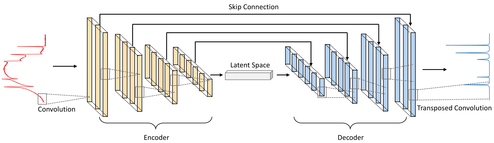

# VECTOR-CARS
Official implementation of VECTOR: Very Deep Convolutional Autoencoders for Non-Resonant Background Removal in Broadband Coherent Anti-Stokes Raman Scattering 

By [Zhengwei Wang](https://villawang.github.io/)\*, [Kevin O’ Dwyer](https://www.maynoothuniversity.ie/people/kevin-o-dwyer)\*, Ryan Muddiman, [Tomas Ward](https://www.computing.dcu.ie/~tward/), [Charles. H. Camp Jr.](https://scholar.google.com/citations?user=FuQ26PQAAAAJ&hl=en) and [Bryan Hennelly](https://scholar.google.com/citations?user=UwRiAWAAAAAJ&hl=en)

**\* Equal contribution**

</img> 

Fig. 1: (a) Diagram of the setup of the B-CARS RMS, (b) CARS energy level diagram (ω_p: Pump frequency, ω_s: Stokes frequency, ω_pr: Probe frequency,ω_as: anti-Stokesfrequency).

</img> 

Fig. 2: The example of VECTOR-8 architecture used in this study. Convolutional layers in the encoder and transposed convolutional layers in the decoder are symmetric i.e., the input dimension to the convolutional layer and the output dimension to the paired transposed convolutional layer are the same.

## Getting Started 
You can use the test jupyter notebook to test the pretrained network

## Requirements 
Required Python environment added here. Better to upload a Docker file.

## Pretrained models
Pretrianed model link added here

## Citation
Formats to cite our paper.
